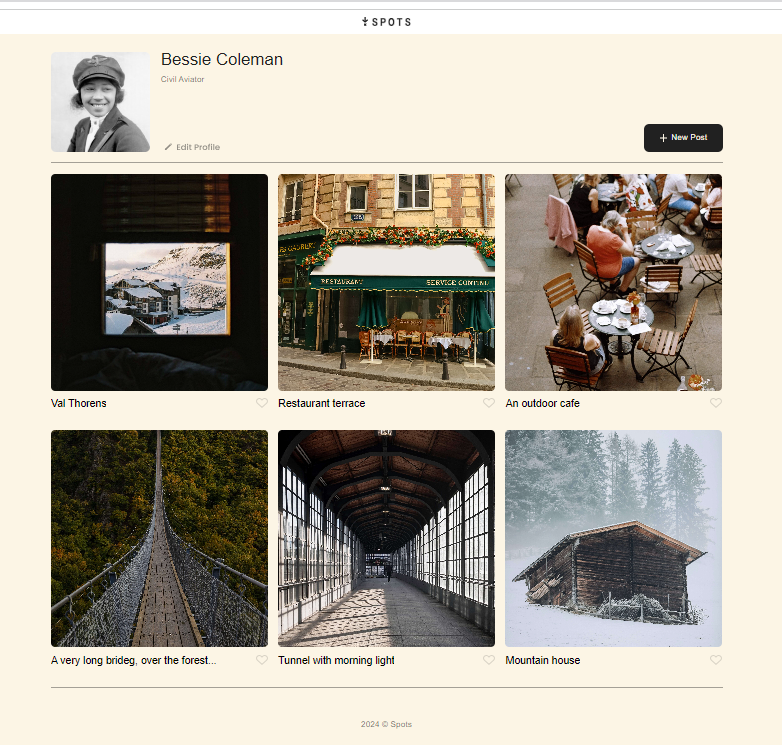
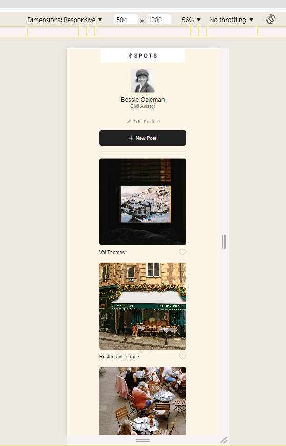

# Project 3: Spots

#Project 3: Spots
Overview
Spots is a responsive web project that ensures all elements are displayed correctly across popular screen sizes, from desktop to mobile. The project focuses on designing and optimizing elements for seamless user experience across devices, following best practices in web design. This project builds on prior experience with layout, design, and responsive development, requiring more attention to detail and effort to complete successfully.

Features
Responsive Layout: The project adapts to various screen sizes, utilizing media queries to ensure the layout looks great on mobile, tablet, and desktop devices.
Modern Typography: The project uses the Poppins font family from Google Fonts to create a clean and modern look across all text elements.

Optimized Images: All images are exported directly from Figma and optimized for web performance.
Design Consistency: Elements in the project follow consistent spacing, alignment, and visual hierarchy to improve readability and overall design coherence.

Technologies Used
HTML5: For structuring the content and elements of the webpage.
CSS3: To style and create the responsive layout using Flexbox and media queries.
JavaScript (optional): If any interactivity or additional dynamic features are included.
Figma: Used for designing the layout and extracting assets.

Design Reference

The design of this project is based on a Figma file that provides all the necessary guidelines and components for building the layout. You can find the original design and assets below:

Link to the project on Figma

Images
All images used in the project were exported directly from Figma and optimized to reduce file size without sacrificing quality. You can optimize your images using TinyPNG to ensure faster load times and improved web performance.

Screenshots
Here are some visual highlights of the project across different screen sizes:

Desktop View:

Mobile View:

Video Presentation

To better understand the project, you can watch a video walkthrough where the layout, features, and design decisions are explained in detail. This video is in production now.

Watch the video on Loom once it is ready.
GitHub Pages Link
You can view the live project deployed on GitHub Pages using the following link:https://github.com/aliminagar/se_project_spots
Thank you
